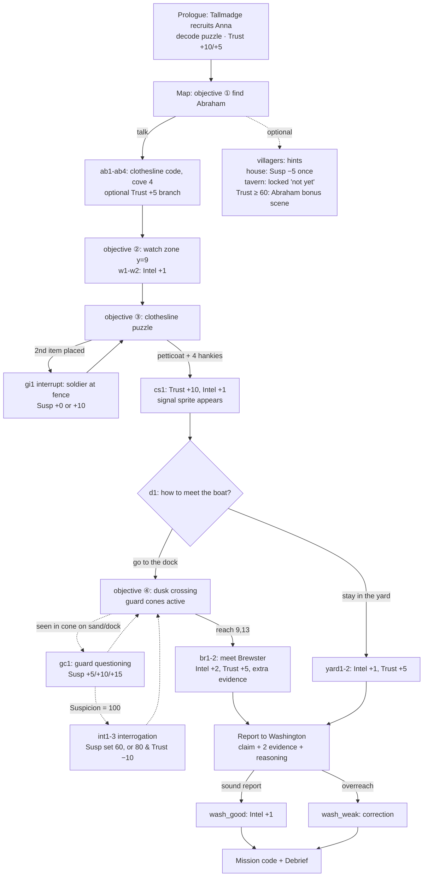

# DESIGN_REVIEW — Shadow War: The Culper Ring (Walkable Setauket Pilot)

Prepared for external review by a game designer / educator. This document describes **what exists in the repository as of 2026-07-15** — no aspirations, no plans, except where explicitly marked as unbuilt. Screenshots in `design-review/screens/` were generated from the actual game with headless Chrome; they are documentation only and are not loaded by the game.

---

# 1. Executive Summary

**Purpose.** A single-file HTML interactive history lesson in which students play a member of the Culper Spy Ring (1778–1780) in British-occupied Long Island. The shipped content is the shared prologue plus **Anna Strong, Mission 1: "The Signal"**, played on a walkable 20×15 tile map of Setauket — the "walkable world pilot" whose core research question is whether tile-based movement adds immersion without wasting class time.

**Audience.** 8th-grade U.S. History students; most read at 4th-grade level or below; a large Spanish-speaking population; old Chromebooks (1024×600 floor), possibly offline; 45-minute class periods.

**Educational objectives** (from the master spec): why intelligence mattered in the Revolution; the mechanics and risks of the Culper Ring specifically; the role of ordinary civilians — especially women — in the war; and primary-source thinking (codes, observation, evaluating evidence). The mission ends in a scaffolded claim–evidence–reasoning report.

**Estimated mission length.** Design target is ~30 minutes for the mission plus ~5–10 for the prologue (one class period). Measured *forced* walking is ≈44 tiles ≈ 6.5 s of movement (BFS-measured; see §3). **Actual classroom timing has not been measured — it cannot be determined from the repository.**

**Core loop.** Read a short bilingual dialogue chunk (≤3 sentences) → make a choice or walk somewhere → observe the world (guard patrols, villager hints) → solve a historically real tradecraft puzzle → see immediate stat feedback (Suspicion / Trust / Intel) → compose an evidence-based report → receive a resumable Mission Code.

**Technologies.** One self-contained `index.html` (~208 KB): vanilla JS, Canvas 2D, DOM overlays, Web Speech API for read-aloud. No frameworks, no network calls, no image files — all art is programmatic pixel data authored in `src/world/` modules and injected into the HTML by a dependency-free bundler (`node build.js`). Tests: a no-dependency asset/map suite (52 checks) and a jsdom end-to-end playthrough suite (38 checks).

---

# 2. Mission Flow — Anna Mission 1

## 2.1 Numbered walkthrough

Objectives shown in the banner (bilingual; exact EN strings): ①"Find Abraham Woodhull at his farm." ②"Watch the soldiers by the shore. Stay off the sand." ③"Hang the signal on your clothesline." ④(dock branch only)"Reach the end of the dock. Stay out of the guards' sight." ⑤"The signal worked. Open your report to Washington."

**Prologue (before the map; dialogue only, ~8 nodes):**
1. 1779 framing (2 nodes). Choice at Tallmadge's arrival: *"Why do you hide your name?"* vs *"You should leave. This is dangerous."* (both converge; no stat change).
2. Nathan Hale's fate, one plain sentence; introduces the cipher rationale.
3. **Decode puzzle** (tap each number, choose its word from three options; code book openable): "721 met 722 at 729." Wrong picks shake; no penalty.
4. Suspicion-meter teach. Choice: *"I will help you."* (**Trust +10**) or *"I need to think about it."* (**Trust +5**, one extra node).
5. Anna intro (Selah on the prison ship) → first-run controls overlay (2 screens, skippable) → map.

**On the map (objective ①):**
6. Spawn at (4,4) in Anna's yard. Optional interactions available at any time: Anna's door (first visit: character beat + **Suspicion −5**, repeat visits: flavor), Widow Foster (hint: soldiers watch the docks at midday), Mr. Hart (Roe's tavern searched twice — foreshadow), Jonah Greene (2 nodes; hint: patrols turn at the posts, same steps every day), Roe's tavern door (locked marker; friendly "another mission will bring you here" node `tav1`), clothesline early (nudge: talk to Abraham first).
7. Walk to Woodhull's farm through the gate; talk to **Abraham** (`ab1`→`ab2`). Choice: *"How do I warn him?"* (direct) or *"Why me, Abraham?"* (**Trust +5**, extra warmth node `ab2b`). He teaches the clothesline code and names **cove four**; sets flag `knowsCode`, objective ②.
8. Walk to the grass above the rope posts (trigger zone y=9, x=2–14). Nodes `w1`→`w2`: patrol observation. **Intel +1**, flag `watched`, objective ③. (Interacting with the clothesline before this fires a gating nudge, `cl_watch`.)
9. Return to the clothesline; interact → **clothesline puzzle** (overlay; world paused). Tray: black petticoat ×1, white handkerchiefs ×6, decoys (work shirt ×2, apron ×1, wool socks ×2); 7 slots. Win = exactly 1 petticoat + 4 handkerchiefs. After the second item placed, a one-time **interrupt** (`gi1`): a soldier slows at the fence. Choice: *keep hanging clothes calmly* (**Suspicion +0**, explicitly shown) or *hurry inside* (**Suspicion +10**). Wrong "Check the line" attempts give gentle bilingual feedback; two hints exist (second reveals the answer); hint use is tracked in state, never penalized.
10. Success → `cs1`: **Trust +10, Intel +1**, flag `signal`; the map's clothesline sprite gains the petticoat + 4 handkerchiefs overlay. Auto-continues to dusk choice `d1`.
11. **Branch (the mission's main choice):**
    - **Dock route** (`d_dock`): flags `dusk` + `dockPath`, objective ④, night tint + guard lanterns. Player crosses the restricted sand at column 9, timing the two patrol cones. Stepping on the dock end (9,13) triggers `br1`→`br2`: meeting **Caleb Brewster** — **Intel +2, Trust +5**, plus an extra evidence card ("the British are counting their ships").
    - **Yard route** (`yard1`→`yard2`): safe; **Intel +1, Trust +5**.
12. **Guard encounters (any time on restricted sand/dock inside a cone):** `gc1` — "What are you doing near the dock, ma'am?" Choices: washtub lie (**Suspicion +5**, sets `toldWashtub`), "Nothing!" (**+15**), silence (**+10**). Never instant failure; 6-second cooldown after release prevents loops.
13. **Interrogation (Suspicion reaches 100 via any choice):** 3-node scene (`int1`–`int3`). Boring-but-true answer → released, **Suspicion set to 60**; checkable lie → held for hours, **Suspicion set to 80, Trust −10**. Mission continues either way.
14. Optional: returning to Abraham after the signal with **Trust ≥ 60** unlocks the bonus scene `ab_bonus` ("I am afraid every single day… I do the work anyway") — **Trust +5**, once.
15. **Report to Washington** (objective ⑤; overlay): choose 1 claim of 3 (one is an unsupported overreach), 2 evidence cards drawn from what the player actually discovered (decoys mixed in; the Brewster card exists only on the dock route), typed reasoning after a bilingual sentence starter. Wax-seal send → Washington's reply: praise + **Intel +1** if claim and both cards are sound, otherwise a gentle correction ("Report only what you saw. Guesses cost lives.").
16. **Mission complete screen:** stats, the Mission Code (~650 characters; carries language, stats, flags, choices, report, map position/facing, fired triggers, guard patrol phase), copy button, and the **Debrief** (printable/copyable submission artifact: name line, stats, full report with Washington's note, choice history, hints used, code).

Stat ranges: Suspicion 0–100, Trust 0–100 (starts 50), Intel 0–10. Every stat change displays immediately with a one-line explanation; no change is previewed before a choice.

## 2.2 Flowchart



---

# 3. World Layout

## 3.1 Annotated ASCII map (the actual game data, `src/world/maps/setauketMap.js`)

```
    0123456789...........19
 0  TTTTTTTTTTTTTTTTTTTT   forest border
 1  ThMhhT...d..fffZZZ.T   Anna roof+chimney | farm fence | barn roof
 2  TnHAnT...d..fggzDz.T   window-wall-DOOR-window | field | barn wall+door
 3  T...qqC..d..fggggf.T   garden · CLOTHESLINE | tilled field (Abraham at 15,3)
 4  TKL....e.d..ff=fff.T   great oak | yard spur | farm GATE (walkable)
 5  Tkl....e.d......ss.T   oak trunks | stone wall
 6  Tddddddddddddddddd.T   east-west road
 7  Tu....eoed.....hMh.T   bush | packed dirt + WELL | tavern roof+chimney
 8  T......e.d.....xyx.T   (Widow 6,7 · Hart 13,8) | tavern wall+lit window
 9  T........d.....Vxx.T   watch zone row (Jonah 12,9) | tavern DOOR (west-facing)
10  TPPPPPPPPdPPPPPPPPPT   rope-post boundary; gap at x=9
11  Tr~~~~~~~~~~~~~~~~rT   restricted sand; guard patrols; rocks at ends
12  T~~~~~~~bbb~~~~~~~rT   mud waterline + dock boards + beached rowboat
13  WWWWWWWWbBbWWWWWWWWW   shallow water + dock end B (Brewster trigger)
14  WWWWWWWWWWWWWWWWWWWW   deep water
```

**Legend** (full version with deterministic variant rules documented in `mapLegend.js`): `.` grass (3 hash-picked variants) · `d` path (edge variants by neighbors) · `e` packed dirt · `g` tilled field · `q` kitchen garden · `~` restricted pebbled sand (auto-mud at the waterline) · `W` water (auto-shallow beside sand; 2-frame shimmer) · `b/B` dock · `T` tree (auto-solid-canopy in the interior) · `u` bush · `r` rocks · `s` stone wall · `K L k l` 2×2 great oak · `H/n/A` light clapboard wall/window/door · `x/y/V` dark tavern wall/lit window/door · `h/M` roof/chimney roof · `Z z D` barn · `f/=` fence/open gate · `P` rope post · `o` well · `C` clothesline.

**Collision:** blocking characters are `T W H h f P o C A V u r s K L k l n x y M Z z D`; walkable are `. d e g q ~ b B =`. Solid props additionally block: barrel (2,12), crate (3,12), rowboat (15–16,12), trough (18,7), hitching post (18,8), woodpile (13,2), firewood (2,8). Rope coil, net, dock posts, sign, basket, flowers, tufts, hay, tool, cat, dog do **not** block. Bushes and rocks block movement but not guard sightlines; buildings, trees, oak, and stone wall block both.

**Entities & spawn:** Anna spawns (4,4) facing south. Abraham (15,3) facing west; Jonah Greene (12,9) south; Widow Foster (6,7) east; Mr. Hart (13,8) west. Brewster is not a walking entity: at dusk on the dock route his boat + north-facing figure render at the dock end. Guards: variant A patrols (2,11)↔(8,11); variant B patrols (17,11)↔(11,11) — straight deterministic loops flanking the single crossing at column 9, visible from safe ground so students can time them.

**Restricted zone:** all `~ b B` tiles — marked three ways: pebbled ground texture, a baked translucent crimson tint, and the physical rope-post border (plus rocks). Guard cones only matter there.

**Trigger tiles:** watch zone (y=9, x=2–14 and the gap tile 9,10; fires `w1` once under objective ②); dock boards before the dock objective (fires `dock_early` once); dock end (9,13) fires `br1` under objective ④.

**Distances (BFS-measured by the test suite):** spawn→Abraham **13** tiles; Abraham→watch zone **6**; watch zone→clothesline **13**; clothesline→dock end **12**. Total forced walking ≈ 44 tiles ≈ 6.5 s of pure movement at 140 ms/tile.

---

# 4. Visual Design

All 130 assets are 16×16 palette-indexed pixel buffers (exceptions noted), rasterized once at load, scaled ×2 with nearest-neighbor. One shared 53-entry palette (`palette.js`) with documented uses; **british-crimson (#a83232) and its dark variant are reserved by an enforced audit** for `faction:"british"` sprites only. No placeholders ship — the only placeholder-style asset is the intentional magenta missing-ID fallback.

**Terrain (23 tiles).** `tile.grass.0/1/2` (hash-picked), `tile.dirt.0`, `tile.path.center/.ns/.we/.cross` (neighbor-picked), `tile.sand.0/1` (registered, currently unused on the map — the whole pilot shore uses `tile.sand.restricted`), `tile.mud.0`, `tile.water.0/1` + `tile.water.shallow.0/1` (2-frame shimmer, neighbor-picked), `tile.soil.0`, `tile.garden.0`, `tile.tree.0` / `tile.tree.deep`.

**Natural barriers (8).** `tile.bush.0`, `tile.oak.nw/ne/sw/se` (2×2 landmark), `tile.wall.stone`, `tile.rocks.0`.

**Structures (16).** `tile.house.wall/.window` (light clapboard, Anna), `tile.house.wall.dark/.window.dark` (tavern; windows have small amber-lit panes), `tile.roof.0`, `tile.roof.chimney` (smoke animates above it), `tile.door.house`, `tile.door.tavern`, `tile.barn.roof/.wall/.door`, `tile.fence.0`, `tile.fence.gate` (drawn open because it is walkable), `tile.post.0`, `tile.dock.0`, `tile.well.0`, plus legacy `tile.wall.0` (kept for compatibility; not on the map).

**Props (19).** Clothesline family — `prop.clothesline.empty` (map state), `.signal.m1` (the win overlay: petticoat + 4 handkerchiefs), `.item.petticoat`, `.item.hank` (compose pieces for future missions), `.wash` (registered, unplaced). Village/dock: `prop.trough`, `hitchpost`, `sign.tavern`, `woodpile`, `firewood`, `basket`, `barrel`, `crate`, `rope`, `net`, `dockpost`, `rowboat` (32×12), `boat` (26×8, Brewster's), `wheelbarrow` (**registered, never placed**).

**Ambient (15).** `amb.chicken.0/1`, `amb.bird.0/1`, `amb.smoke.0/1/2`, `amb.laundry.0/1` (registered, deliberately unplaced to protect the clothesline's uniqueness), `amb.dog`, `amb.cat`, `amb.tuft`, `amb.flowers`, `amb.tool`, `amb.hay`. Animation groups: chicken/bird 2 frames, smoke 3 frames — all pinned to frame 0 under reduced motion.

**Characters (49 frames).** `anna.walk.<south|north|west|east>.<0|1>` (8) + `anna.idle` group aliasing frame 0. `guard.walk.*` (variant A, musket right) and `guard.b.walk.*` (variant B, musket left + haversack), 8 frames each, exposed as `guard.variantA/B`. Six NPC idle sets × 4 facings (24): Abraham (straw hat, staff), Widow (cap, basket), Hart (tricorn, cane, white hair), Jonah (cap, green waistcoat, deep skin tone), Brewster (tricorn, rolled sleeves, rope coil), Youth (bare-headed; **registered, not placed**). Plus one palette-swap demo `npc.villager.woman.brown.idle.south`.

**UI (3).** `ui.marker.interact` (amber diamond), `ui.marker.talk` (speech bubble), `ui.marker.locked` (latched bar) — 8×8, drawn at 16 px above the faced target.

**Effects.** Sight cones (pre-rendered wedges per direction/length/calm — crimson tint, 3 tiles), lantern glow (cached 112×112 radial), dusk wash, drop shadows, debug grid. **Labels/HUD** are DOM, not sprites (see §6).

---

# 5. Screens

All images generated from the running game (headless Chrome, real renders) in `design-review/screens/`:

| File | Shows |
|---|---|
| `01-title.png` | Title screen, language toggle, code entry |
| `02-full-map.png` | Full 640×480 canvas, day |
| `03-anna-yard.png` | NW: house, chimney smoke, garden, oak, clothesline |
| `04-woodhull-farm.png` | NE: fences, gate, field, barn, Abraham, chicken |
| `05-village-center.png` | Road, well, packed dirt, Widow, ambient hints area |
| `06-tavern.png` | Dark boards, lit windows, hanging sign, dog, trough |
| `07-dock-guards.png` | Restricted shore, both patrols with sight cones, dock props |
| `08-hud-objective-banner.png` | Full 1024×600 page: HUD meters + objective banner above canvas |
| `09-dialogue-overlay.png` | `ab1` dialogue: speaker strip, read-aloud, Continue |
| `10-clothesline-puzzle.png` | Puzzle overlay: cord, slots, item tray, hint/check |
| `11-pause-accessibility.png` | Pause menu = accessibility settings (Calm Patrols, reduce motion, touch controls, code, language) |
| `12-dusk-dock.png` | Night tint, lantern glows, cones at dusk, Brewster's boat |

There is no separate accessibility screen — those settings live in the pause menu (`11`). A live asset-preview panel (palette, every sprite, animation players, grayscale/reduced-motion toggles) exists behind debug mode.

---

# 6. User Interface

- **HUD** (DOM bar above the canvas; always visible in play): "SHADOW WAR" wordmark; three meters with SVG icons — Suspicion (eye; amber→crimson fill), Trust (hands; green), Intel (sealed letter; "n / 10"); Code book button (slide-in paper panel listing the real Culper numbers); language toggle rendered "EN | ES" with the *target* language emphasized; menu (☰). Buttons ≥44 px; all focusable with a 3 px amber focus ring.
- **Objective banner** (DOM bar between HUD and canvas): amber dot + one bilingual line + its own read-aloud button. Exactly one objective at a time; physically cannot overlap the canvas.
- **Canvas** 640×480 logical, integer-scaled when ≥1×, `image-rendering: pixelated`, keyboard-focusable.
- **Floating name label** (DOM over canvas): paper-cream, 2 px ink border, current language only, appears when adjacent + facing an interactable; slow 1.2 s bob, disabled under reduced motion; positioned above the interaction marker, which sits above the target's head.
- **Interaction markers** (canvas): §4 UI sprites; slow sine bob (±2 px), frozen under reduced motion.
- **Touch controls** (auto-shown on coarse pointers; toggleable): 3×3 D-pad bottom-left (52 px buttons), circular ✋ Interact button bottom-right (76 px) that lights amber when a target is faced; tapping an adjacent interactable also interacts.
- **Dialogue overlay** (bottom-anchored modal): speaker strip (small caps, amber; crimson border + darker palette for interrupt scenes), one 2–3-sentence chunk at a time, per-chunk read-aloud, stat-change toast with icon, Continue / choice buttons (full-width, left-aligned text); focus lands on the first action button (asserted in tests). World updates pause while any modal is open.
- **Puzzle overlay** (centered modal): decode chips + 3-option word choices; clothesline slots + item tray with counts + Hint + "Check the line".
- **Vocabulary cards:** dotted-underline terms in dialogue open a small modal: word, EN/ES translation line, one-sentence definition in the current language, SVG icon, read-aloud.
- **Pause menu (Esc / ☰):** resume, how-to-play replay, Calm Patrols toggle, Reduce Motion toggle, touch-controls toggle, "Get a Mission Code now", language, quit (with are-you-sure and a code warning).
- **Report builder / seal / mission-complete / Debrief screens:** claim radio list, 2-of-N evidence cards, sentence-starter textarea; wax-seal animation; code display with copy; print-styled Debrief.
- **Localization behavior:** every string in the UI, story, puzzles, labels, and objectives has an ES mirror; toggling re-renders the open screen in place; `document.documentElement.lang` tracks the choice; read-aloud switches between en-US and es-US voices.

---

# 7. Educational Design

**Where learning happens:**
- **Ciphers / primary sources:** the prologue decode puzzle uses the ring's real code numbers (711, 721–729, 355…); the code book is a persistent in-game reference students consult voluntarily.
- **Observation as intelligence:** the mission's central loop — watch the patrol *before* acting — is taught by the map itself (visible cones, deterministic routes) and reinforced by Jonah's and the widow's hints. The watch-zone node converts observation into an Intel point explicitly.
- **Historical mechanics:** the clothesline signal (black petticoat = come; handkerchief count = cove) is the documented Anna Strong tradition, taught diegetically by Abraham and executed by the student.
- **Evidence-based writing:** the CER report requires choosing a claim the student's own discoveries can support; unsupported claims receive Washington's correction — a consequence, not a grade. The Debrief is the submittable artifact.
- **Civilian risk and stakes:** Hale in the prologue, the interrogation system, Selah on the prison ship, and Abraham's bonus scene ("courage is being afraid and doing it anyway") carry the affective goals. Suspicion mechanics make "ordinary is invisible" a played experience, not a stated moral.
- **Representation:** Jonah Greene, a free Black ferryman, chooses to pass intelligence — a documented-context role written with agency (flagged in BUILD_LOG for the teacher's review).
- **Vocabulary:** ten bilingual tooltip cards (spy, intelligence, cipher, Loyalist, Patriot, occupied, treason, courier, dead drop, suspicion).

**Gameplay without direct educational purpose (honest list):** the ambient critters (chicken, cat, dog, bird), chimney smoke, flowers/tufts, and most dock props teach nothing; they exist to make the settlement feel inhabited (an immersion bet the pilot is testing). Walking itself is the pilot's open question. The stat system is a game abstraction, though each number maps to a real concept (being watched, being relied upon, delivering intelligence).

---

# 8. Accessibility

- **Reduced motion:** honors `prefers-reduced-motion` plus an in-game toggle. Movement becomes instant tile steps (fixed 140 ms cadence retained so speed doesn't change), water shimmer stops, ambient animation pins to frame 0, label bob and marker bob stop, CSS animations disabled. Tested.
- **Keyboard:** arrows/WASD move; E/Space/Enter interact; Esc opens the menu; dialogue focus lands on an action button whenever a dialogue opens (asserted in e2e). *Caveat:* activating that button with Enter relies on native browser behavior, which jsdom cannot prove — untested on real hardware.
- **Touch:** D-pad + Interact button + tap-adjacent-tile; 44 px+ targets; tested end-to-end in jsdom via pointer events. The D-pad overlaps the map's SW corner (nothing interactive lives there) — needs device confirmation.
- **Language:** full EN/ES mirrors everywhere, natural Latin American register, persistent toggle, one language at a time.
- **Read-aloud:** Web Speech on every dialogue chunk, the objective banner, and vocab cards, in the current language. Voice availability/quality depends on the device and **cannot be determined from the repository**.
- **Colorblind / grayscale:** danger is double-coded (crimson + tall-hat silhouette — enforced by a test that only British sprites touch pixel row 0); the restricted zone is triple-coded (texture + tint + physical border); verified readable in grayscale renders including the dusk worst case. No flashing anywhere; timers exist only in later-mission designs, not in this build.
- **No capture-as-failure:** being caught always routes through dialogue; Suspicion 100 triggers an interrogation, not a game over.

---

# 9. Technical Architecture (reviewer's summary)

- **Renderer:** Canvas 2D, fixed camera. The entire static map (variant-resolved tiles, static props, restricted tint) is baked at init into two 640×480 canvases (one per water frame); a frame draws ~6–10 cached images plus characters. Documented 10-layer draw order in `worldRenderer.js`. Measured cost: ~0.18 ms/frame on a desktop at the heaviest scene.
- **Sprite system:** palette-indexed pixel buffers (`{width, height, pixels[][]}`) authored procedurally; a registry resolves dot-path IDs to cached canvases, defines animation groups, rejects duplicates, audits crimson misuse/blank frames/missing anim refs, and returns a loud magenta fallback for unknown IDs.
- **Map system:** ASCII rows + a legend giving physics sets and deterministic variant resolution (position hash + neighbor rules); props and ambient entries are data in the map module; a numeric-key set answers prop collision queries.
- **Entity system:** static data records (`sprite`, `facing`, position, bilingual label, `node()` resolver, optional `dz`/`kind`) resolved to cached canvases at init; guards are separate records with waypoint arrays, per-guard animation sets, and movement-synced step frames.
- **Dialogue system:** a flat node table (`NODES`) with bilingual chunk arrays, choices carrying stat effects and flags, node-level effects, objective setters, puzzle launchers, and end-of-node routing (map / report / complete). Vocabulary markup and name styling are inline conventions rendered at display time.
- **Save codes:** base64 of compacted JSON (`CR1.` prefix) carrying language, scene, node, stats, flags, objective, hints, choice log, reports, map position/facing/fired triggers, and guard patrol phase; localStorage is a convenience layer only and the game survives storage being disabled.

---

# 10. Current Weaknesses (unminimized)

1. **Registry drops `group` metadata** (`spriteRegistry.register` doesn't copy it), so the asset preview's grouping silently falls back to coarse `kind` buckets instead of the intended terrain/nature/structures/landmarks/dock/ambient sections. Dev-only, but the Phase 2.6 BUILD_LOG claim of fine-grained grouping is inaccurate as shipped.
2. **The barn door is visual-only.** It looks like a door, shows no label, and does nothing — a curious student will press E at it and get silence. Needs one bilingual node.
3. **Mission codes are ~650 characters** — fine to copy/screenshot, unrealistic to hand-write. A decision on trimming (e.g., dropping the choice log) is still open with the teacher.
4. **Never tested on real hardware:** no physical Chromebook pass, no real touch device, no verification of Spanish TTS voice quality, and the 6× CPU claim rests on a headless benchmark, not interactive DevTools throttling.
5. **Keyboard dialogue activation** is verified only to the point of focus placement; native Enter-activation is assumed.
6. **Interrogation failure is simplified** relative to the master spec (release with penalties instead of "imprisoned; continue as another ring member"). Inter-mission Suspicion decay (−5 for "lay low") is also unimplemented — both are single-mission scoping.
7. **Unused assets:** `prop.wheelbarrow`, `prop.clothesline.wash`, `amb.laundry.*`, `npc.youth` (all facings), `npc.villager.woman.brown`, `tile.sand.0/1`, `tile.wall.0`, `tile.dirt.0` is used only at the well — inventory exists ahead of need.
8. **12 of 13 missions, the finale, epilogues, and "Real vs. Imagined" screens do not exist.** Three character-select cards are locked placeholders. Dialogue portraits do not exist (documented recommendation only).
9. **Suspicion-triggered interrogation** fires only from choice-driven changes; a node-level effect pushing Suspicion to 100 would not trigger it (no such node currently exists).
10. **Two objective legs (12–13 tiles) exceed the addendum's ~10-tile guideline** — documented as accepted geography, but a reviewer should judge.
11. Headless screenshots cannot capture the label DOM inside canvas exports (labels verified separately); the preview panel is functional but unpolished.

---

# 11. Known Design Tradeoffs (simplicity chosen deliberately)

- **Fixed camera, one screen** — kills scrolling bugs and disorientation for the target readers (addendum mandate).
- **Grid movement, no diagonals, no physics; 1-frame-alternation walk** — legible on weak hardware; input buffering is the only sophistication.
- **Guards never chase and are strictly deterministic** — the addendum's "tension without twitch skill"; detection is dialogue, not death.
- **Cones are 3 straight tiles, 1 wide** — a rule students can *see and count*, not a realistic vision model.
- **16×16 figures with no faces or hands** — silhouette-first identity; historical texture (muskets, rolled sleeves) is gestural.
- **Shako-style tall hats** on 1779 regulars are knowingly ahead of strict uniform chronology — traded for the strongest colorblind-safe silhouette (documented in BUILD_LOG).
- **The tavern sign is muted gold, not red** — the crimson-is-British color rule outranks signage realism.
- **A 53-color palette and deterministic tile variants** — calm fields over naturalistic variety.
- **No autotiling engine** — explicit variants + a small neighbor-rule resolver.
- **Depth = y-sort + optional per-entity offset** — no general depth system, per the task constraints.
- **Save codes over accounts/servers** — offline-first, shared-Chromebook-safe, at the cost of code length.
- **Interrogation/capture simplified** for the pilot (see §10.6).

---

# 12. Suggested Questions for Review

1. Does walking measurably add engagement over the menu-based scene selection it replaced, for *this* reading population?
2. Is ~44 tiles of forced movement the right amount — or should the two 12–13-tile legs be shortened even at the cost of quadrant identity?
3. Is the clothesline landmark strong enough that a student who looks away from the objective banner can still find their goal?
4. Do the visible sight cones teach patrol-timing, or do students just walk into them to see what happens? Is the +5/+10/+15 Suspicion spread meaningful?
5. Is the dock-vs-yard choice a real decision for 13-year-olds, or does the extra Intel make the dock strictly dominant? Should the yard route carry compensating value?
6. Does the mid-puzzle guard interrupt heighten tension or annoy students who just want to finish placing handkerchiefs?
7. Is "watch the soldiers first" gating (clothesline refuses before observation) good scaffolding or unnecessary friction?
8. Are the ambient hints (widow, Jonah) discoverable enough given they're optional — and is critical information ever *only* ambient? (It isn't by design — verify.)
9. Is Suspicion legible as a concept when most students may never see the interrogation at 100?
10. Does the CER report ask enough of students, given the claim options do most of the framing? Is one decoy evidence pair sufficient rigor?
11. Is Washington's corrective reply ("Guesses cost lives") the right feedback register for a wrong claim, or should the report be revisable before sealing?
12. Is the 4th-grade reading level actually achieved in Spanish as well as English? (Sentence-length tests exist only for English.)
13. Are the interrogation outcomes (60 vs 80 Suspicion) meaningfully different to a student, or is the difference cosmetic?
14. Does Jonah Greene's characterization meet the "dignity and agency" bar? What would strengthen it?
15. Is the tall-hat anachronism an acceptable trade for silhouette accessibility in a history product?
16. Are ~650-character mission codes workable in a real classroom's routines (copy vs. handwrite vs. screenshot)?
17. Does the tavern's locked door build anticipation for Mission 2 or read as a broken feature? (Compare with the truly inert barn door — §10.2.)
18. Is dusk (45% dark wash) readable on a low-quality, high-glare classroom Chromebook panel?
19. Should the bonus Abraham scene (Trust ≥ 60) be signposted, or is invisible gating acceptable for optional warmth content?
20. Is the movement layer worth its engineering weight for the remaining 12 missions, or should some missions stay menu-based?

---

# Appendix A — Project file tree

```
culper-ring-lesson/
├── ART_BIBLE.md
├── BUILD_LOG.md
├── CLAUDE_Addendum_Walkable_Setauket.md
├── CLAUDE_Culper_Ring_Spec.md
├── DESIGN_REVIEW.md                  ← this document
├── build.js                          ← bundler: src/world → index.html markers
├── index.html                        ← THE deliverable (single file, ~208 KB)
├── design-review/
│   └── screens/                      ← 12 PNG renders (documentation only)
├── src/world/
│   ├── art/        palette.js · pixelUtils.js · spriteRegistry.js
│   ├── characters/ figureKit.js · annaSprites.js · npcSprites.js · guardSprites.js
│   ├── effects/    worldEffects.js · sightCones.js
│   ├── maps/       mapLegend.js · setauketMap.js
│   ├── previews/   assetPreview.js · preview.html (dev page)
│   ├── rendering/  worldRenderer.js · entityRenderer.js · effectRenderer.js · compose.js
│   ├── tiles/      terrainTiles.js · natureTiles.js · structureTiles.js ·
│   │               propTiles.js · ambientProps.js
│   ├── ui/         uiMarkers.js
│   └── init.js
└── tools/
    ├── test-assets.js                ← 52 static checks (no dependencies)
    └── test-e2e.js                   ← 38 playthrough checks (requires jsdom)
```

# Appendix B — Markdown design documents

| Document | Role |
|---|---|
| `CLAUDE_Culper_Ring_Spec.md` | Master design spec: full 4-character game, 13 missions, systems, guardrails |
| `CLAUDE_Addendum_Walkable_Setauket.md` | Walkable-world pilot spec (this build's movement layer) |
| `ART_BIBLE.md` | Visual style rules: palette law, silhouette rules, character/environment rules, layer order |
| `BUILD_LOG.md` | Per-phase engineering log: decisions, measurements, known limitations, open questions |
| `DESIGN_REVIEW.md` | This document |
